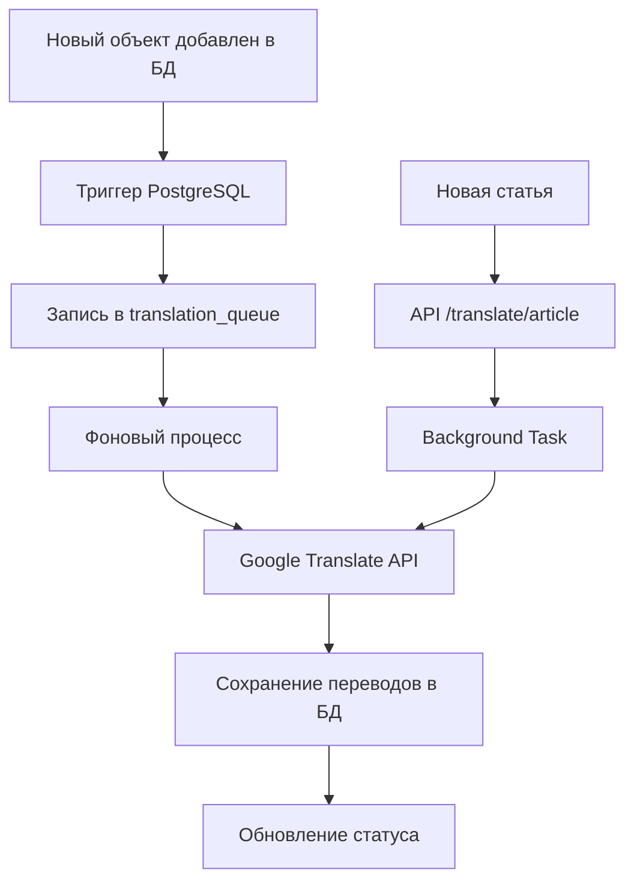

# 🤖 Система автоматизации переводов

## 📋 Обзор системы

Создана комплексная система автоматического перевода для новых статей и объектов недвижимости, которая позволяет:

- ✅ **Автоматически переводить** новые объекты недвижимости при добавлении в БД
- ✅ **Переводить статьи** через API или админку
- ✅ **Управлять очередью переводов** с отслеживанием статуса
- ✅ **Поддерживать 4 языка**: русский, английский, тайский, китайский
- ✅ **Интегрироваться с Google Translate API**

## 🚀 Быстрый старт

### 1. Установка зависимостей

```bash
pip install googletrans==3.1.0a0 asyncpg
```

### 2. Настройка базы данных

Выполните SQL-скрипт в PGAdmin4:

```sql
-- Файл: setup_translation_hooks.sql
-- Создает таблицы, триггеры и функции для автоматических переводов
```

### 3. Подключение к основному приложению

Добавьте в `backend/main.py`:

```python
from routers.auto_translation import router as auto_translation_router

app.include_router(auto_translation_router)
```

## 🔧 Компоненты системы

### 1. **Основные файлы**

| Файл | Назначение |
|------|------------|
| `auto_translate.py` | Основной класс для переводов |
| `backend/routers/auto_translation.py` | API роутер для переводов |
| `setup_translation_hooks.sql` | SQL настройки БД |
| `backend/templates/admin/auto_translate.html` | Админ панель |

### 2. **База данных**

```sql
-- Таблица очереди переводов
translation_queue:
- id (SERIAL)
- content_type (VARCHAR) -- 'property' или 'article'  
- content_id (INTEGER)
- status (VARCHAR) -- 'pending', 'processing', 'completed', 'failed'
- created_at (TIMESTAMP)
- processed_at (TIMESTAMP) 
- error_message (TEXT)

-- Дополнительные колонки в properties:
title_en, description_en      -- Английские переводы
title_th, description_th      -- Тайские переводы  
title_zh, description_zh      -- Китайские переводы
```

### 3. **API Endpoints**

```bash
POST /api/translate/text                 # Перевод отдельного текста
POST /api/translate/article/{id}         # Перевод статьи
GET  /api/translate/queue/status         # Статус очереди
GET  /api/translate/languages            # Поддерживаемые языки
```

## 🎯 Варианты автоматизации

### **Вариант 1: Триггеры PostgreSQL** ⭐ (Рекомендуемый)

```sql
-- Автоматически добавляет новые объекты в очередь переводов
CREATE TRIGGER auto_translate_property
    AFTER INSERT ON properties
    FOR EACH ROW
    EXECUTE FUNCTION add_to_translation_queue('property');
```

**Преимущества:**
- Работает автоматически при добавлении в БД
- Не зависит от приложения
- Высокая надежность

### **Вариант 2: Фоновые задачи FastAPI**

```python
from fastapi import BackgroundTasks

@app.post("/properties/")
async def create_property(property_data: dict, background_tasks: BackgroundTasks):
    # Создаем объект
    property_id = create_property_in_db(property_data)
    
    # Добавляем задачу перевода в фон
    background_tasks.add_task(translate_property, property_id)
    
    return {"id": property_id}
```

**Преимущества:**
- Контроль из приложения
- Возможность настройки логики

### **Вариант 3: Планировщик задач (Cron)**

```python
# translate_worker.py
import asyncio
from auto_translate import process_translation_queue

async def main():
    db_config = {
        "host": "localhost",
        "database": "realestate",
        "user": "postgres", 
        "password": "password"
    }
    
    await process_translation_queue(db_config)

if __name__ == "__main__":
    asyncio.run(main())
```

```bash
# Запуск каждые 5 минут
*/5 * * * * cd /path/to/project && python translate_worker.py
```

## 📊 Использование системы

### **1. Автоматический перевод объектов**

```python
# При добавлении нового объекта недвижимости:
property_data = {
    "title": "Красивая квартира с видом на море",
    "description": "Современная квартира в центре Паттайи...",
    "price": 2500000,
    "location": "Центральная Паттайя"
}

# Объект автоматически попадает в очередь переводов
# через триггер PostgreSQL
```

### **2. Перевод через API**

```javascript
// Перевод отдельного текста
fetch('/api/translate/text', {
    method: 'POST',
    headers: {'Content-Type': 'application/json'},
    body: JSON.stringify({
        text: "Красивая квартира с видом на море",
        source_language: "ru",
        target_language: "en"
    })
})
.then(response => response.json())
.then(data => {
    console.log(data.translated_text); // "Beautiful apartment with sea view"
});
```

### **3. Перевод статьи**

```javascript
// Перевод статьи на все языки
fetch('/api/translate/article/123', {
    method: 'POST',
    headers: {'Content-Type': 'application/json'},
    body: JSON.stringify({
        article_id: 123,
        target_languages: ["en", "th", "zh"],
        auto_publish: true
    })
});
```

## 🎨 Админка переводов

### **Доступ к панели:**
```
http://localhost:8002/admin/auto-translate
```

### **Возможности:**
- 📊 Статистика переводов
- 🔤 Быстрый перевод текста  
- 📰 Перевод статей
- ⚙️ Настройки системы
- 📋 Мониторинг очереди

## 📈 Статистика и мониторинг

### **Проверка статуса очереди:**

```sql
-- Сколько переводов в очереди
SELECT status, COUNT(*) as count 
FROM translation_queue 
GROUP BY status;

-- Последние переводы
SELECT * FROM translation_queue 
ORDER BY created_at DESC 
LIMIT 10;
```

### **API мониторинга:**

```bash
curl http://localhost:8002/api/translate/queue/status
```

```json
{
  "total_in_queue": 5,
  "processing": 2,
  "completed_today": 23,
  "failed_today": 1,
  "available_languages": ["en", "th", "zh"],
  "translation_service": "Google Translate"
}
```

## 🔄 Workflow автоматизации



## 🛠️ Дополнительные возможности

### **1. Обработка очереди вручную**

```python
import asyncio
from auto_translate import process_translation_queue

# Настройки БД
db_config = {
    "host": "localhost",
    "database": "realestate", 
    "user": "postgres",
    "password": "your_password"
}

# Обработка очереди
asyncio.run(process_translation_queue(db_config))
```

### **2. Массовый перевод существующих объектов**

```sql
-- Добавить все объекты без переводов в очередь
INSERT INTO translation_queue (content_type, content_id)
SELECT 'property', id 
FROM properties 
WHERE title_en IS NULL OR title_th IS NULL OR title_zh IS NULL;
```

### **3. Настройка качества переводов**

```python
# В auto_translate.py можно настроить:
- Разбивку длинного текста на части
- Обработку ошибок перевода
- Кеширование переводов
- Альтернативные переводчики
```

## 🎯 Преимущества автоматизации

### **Для администраторов:**
- ✅ Автоматический перевод новых объектов
- ✅ Экономия времени на ручных переводах  
- ✅ Консистентность переводов
- ✅ Мониторинг процесса

### **Для пользователей:**
- ✅ Мгновенное появление контента на разных языках
- ✅ Лучший UX для международных клиентов
- ✅ SEO оптимизация для разных рынков

### **Для бизнеса:**
- ✅ Автоматическое расширение на международные рынки
- ✅ Снижение затрат на переводы
- ✅ Быстрый запуск новых языков

## 🔧 Настройка для продакшена

### **1. Переменные окружения:**

```bash
# .env файл
GOOGLE_TRANSLATE_API_KEY=your_api_key
POSTGRES_HOST=localhost
POSTGRES_DB=realestate
POSTGRES_USER=postgres
POSTGRES_PASSWORD=your_password

# Настройки переводчика
AUTO_TRANSLATE_ENABLED=true
AUTO_TRANSLATE_LANGUAGES=en,th,zh
TRANSLATION_QUEUE_BATCH_SIZE=10
```

### **2. Docker контейнер для обработки переводов:**

```dockerfile
FROM python:3.9
COPY requirements.txt .
RUN pip install -r requirements.txt
COPY translate_worker.py .
CMD ["python", "translate_worker.py"]
```

### **3. Мониторинг и логирование:**

```python
import logging

# Настройка логов
logging.basicConfig(
    level=logging.INFO,
    format='%(asctime)s - %(name)s - %(levelname)s - %(message)s',
    handlers=[
        logging.FileHandler('translation.log'),
        logging.StreamHandler()
    ]
)
```

## 🎉 Итоги

Система автоматических переводов обеспечивает:

- 🚀 **Полную автоматизацию** процесса перевода
- 🌍 **Поддержку 4 языков** с возможностью расширения
- 📊 **Мониторинг и статистику** всех переводов
- 🛡️ **Надежность** через триггеры PostgreSQL
- 🎯 **Простоту использования** через API и админку

**Результат:** Новые объекты и статьи автоматически переводятся на английский, тайский и китайский языки, что значительно расширяет аудиторию и улучшает международное присутствие платформы недвижимости.

---

## 📞 Поддержка

Если у вас есть вопросы по настройке или использованию системы переводов, создайте issue в репозитории или обратитесь к документации FastAPI и Google Translate API. 